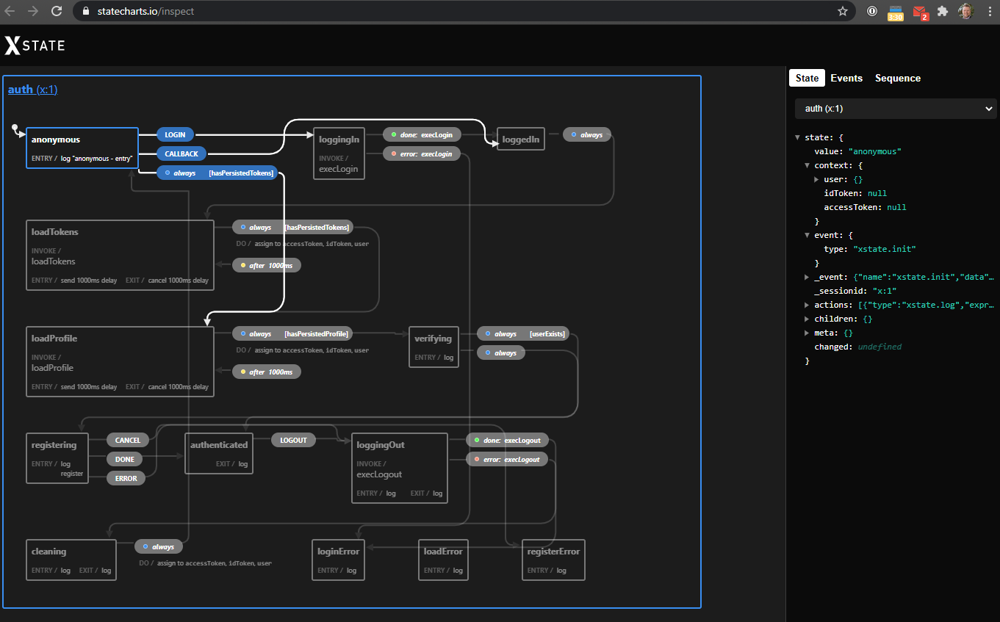

# XState with Authentication

This Vue.js (with [Quasar Framework](https://quasar.dev)) sandbox demonstrates the use of [XState](https://xstate.js
.org/) (finite state machines) while using external authentication services, in this case Auth0.

The problem for me was trying to keep my head wrapped around all of the different areas of the application that was
 tied to authentication, authorization, profile and registration.  Especially when dealing with authentication
  redirection (e.g. any OAuth-like scenario) and browser refreshes.
  
If nothing else, to be able to visually see the state with `statecharts` is extremely helpful, both for
 troubleshooting and developing.
 
Admittedly this was not the easiest project.  I was planning on spending a day on this but ended up spending more
 than 60 hours all told to get it to this point.

## Run Locally

### Prerequisites

#### Auth0
1. [Auth0](https://auth0.com) account (free)
1. Create Application
   - Allowed Callback URLs: http://localhost:8080
   - Allowed Logout URLs: http://localhost:8080/logout
   - Allowed Web Origins: http://localhost:8080, [your auth0 domain url]
   - Allowed Origins (CORS): http://localhost:8080
   - Under Advanced Settings -> Grant Types, make sure `Implicit` is selected
1. Define Connections
   - Enable whatever you prefer.  I tested with Amazon and Google under `Social`

### Clone this repo
```bash
git clone https://github.com/34fame/sandbox-vue-xstate-auth0
```

### Install dependencies
```bash
cd <directory>
yarn
```

### Setup env variables
1. Create a `.env.development` file in the project root
1. Populate the following using settings from your Auth0 account (do not change the redirect uri)

```
AUTH0_DOMAIN=
AUTH0_CLIENTID=
AUTH0_AUDIENCE=
AUTH0_REDIRECTURI=http://localhost:8080/auth_callback
```

### Start the app in development mode (hot-code reloading, error reporting, etc.)
```bash
quasar dev
```

## Explanation

The point of this sandbox was to centrally manage the state of authentication using a finite state machine.  I found
 the XState library to be mature with lots of features.  Below is a live shot of the authentication machine:



### Machine States

- anonymous: The User is not logged in and has not started the login process
- loggingIn: The User has initiated the login process and has been redirected to Auth0's "Universal Login" page
.  The user will then be directed to the authentication source of their choosing based on the Auth0 account settings.
- loggedIn: After Auth0 returns the User to the app and we are able to verify the Auth0 session
- loadTokens: We load the id and access tokens from Auth0 session into Session Storage
- loadProfile: We load the user profile from Auth0 session into Session Storage
- verifying: Look for user in database.  If not there transition to registering; otherwise, transition to authenticated
- registering: Brings user to Register page with value populated from their authentication source.  Submitting
 creates the user in the database while canceling ends the session
- authenticated: This is a final state for the session until they User initiates a Logout
- loggingOut: User initiates logout
- cleaning: The User's session in Session Storage, machine context and Vuex are all cleared.  The machine state is
 then returned to `anonymous`
- loginError: If an error occurs during login or logout
- loadError: If an error occurs during loadTokens or loadProfile
- registerError: If an error occurs during registration

### Vue Interactions
- boot/auth.js: Initiates the AuthMachine and creates the AuthService
- components/AuthCallback.vue: Receives redirect callback from Auth0 after login
- components/Logout.vue: Logouts are redirect here upon completion.  I just used this to validate the sessions were
 all clear and Auth0 recommended having a logout landing page
- components/Register.vue: Form component where new users are directed when they log in the first time
- helpers/api-mock/index.js: A mock API to simulate backend CRUD operations
- helpers/auth/index.js: The Auth0 API calls
- helpers/machines/authMachine.js: The authentication machine definition (authMachine)
- layouts/MainLayout.vue: Displays "login" and "logout" buttons based on auth machine state
- pages/Index.vue: Used to display the User when logged in
- routes/routes.js: Defines routes for auth callback, logout, registration and home
- store/store-auth.js: Contains Vuex store for authentication events as well as storing users from api
- App.vue: Watches for machine state changes to help direct traffic and to hide transitions with "Loading" component
- 
